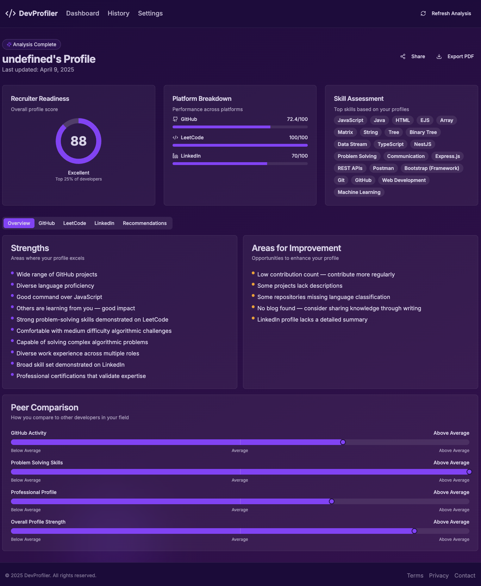

## Backend Code - Profile Analyzer

<a href="https://github.com/Ronak501/backend_profile_analyzer" target="_blank">View Backend Code</a>

# DevProfiler - Profile Analyzer

Analyze your GitHub, LinkedIn, and LeetCode profiles in one place!

<p align="center">
  
</p>

# 🚀 DevProfiler – Developer Profile Analyzer

**DevProfiler** is an intelligent web application that analyzes developer profiles across platforms like GitHub, LinkedIn, and LeetCode. It provides a comprehensive snapshot of a developer’s strengths, weaknesses, and readiness for tech roles, complete with personalized recommendations.

---

## 📊 Features

- **Recruiter Readiness Score**  
  Get an overall profile rating based on multiple platform activities.

- **Platform-wise Performance**  
  Detailed breakdown for GitHub, LeetCode, and LinkedIn.

- **Skill Inference Engine**  
  Extracts top skills (e.g., JavaScript, TypeScript, Python) from real contributions and code.

- **Strengths & Areas to Improve**  
  Highlights what you're doing well and where to grow (like contributing to open source or solving hard LeetCode problems).

- **Peer Comparison**  
  Benchmarks your profile against other developers to show where you stand.

- **Personalized Recommendations**  
  Actionable feedback to grow your GitHub presence, improve your network, or tackle more advanced problems.

---

## 🔥 Tech Stack

### 💻 Frontend
- [Next.js](https://nextjs.org/) (with [TypeScript](https://www.typescriptlang.org/))
- [React.js](https://reactjs.org/)
- [Tailwind CSS](https://tailwindcss.com/)

### 🧠 Backend
- [NestJS](https://nestjs.com/) **or** [Flask (Python)](https://flask.palletsprojects.com/)
  
### 🗃️ Database
- [Firebase](https://firebase.google.com/)


### 🌐 APIs
- [GitHub API](https://docs.github.com/en/rest)
- LeetCode API (unofficial)
- LinkedIn Scraper (custom implementation with Proxycurl)

### 🚀 Deployment
- Frontend: [Vercel](https://vercel.com/)
- Backend: [Render](https://render.com/) or [Railway](https://railway.app/)

---

## 📸 Dashboard Preview

> Below is an example report generated by DevProfiler:


---

## 📝 Usage

### Clone the Repository
```bash
git clone https://github.com/Ronak501/profile-analyzer.git
cd profile-analyzer
